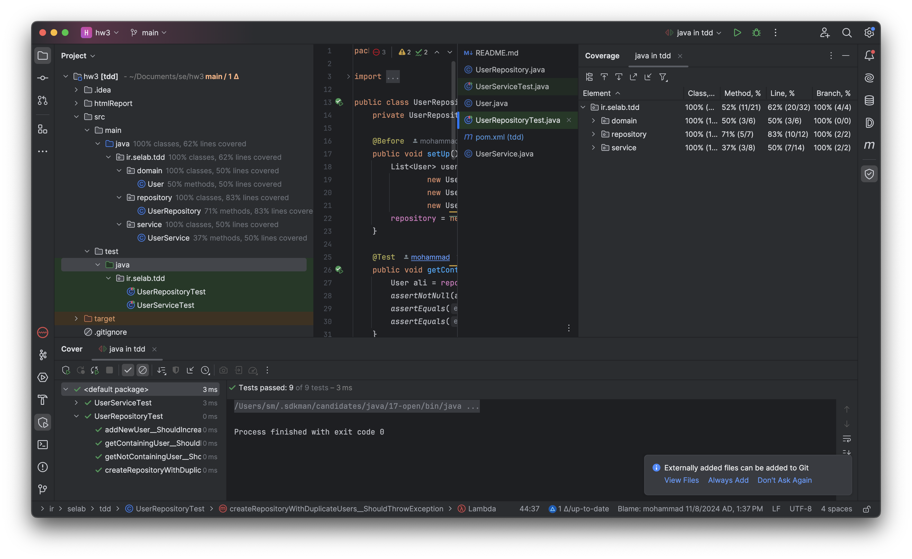
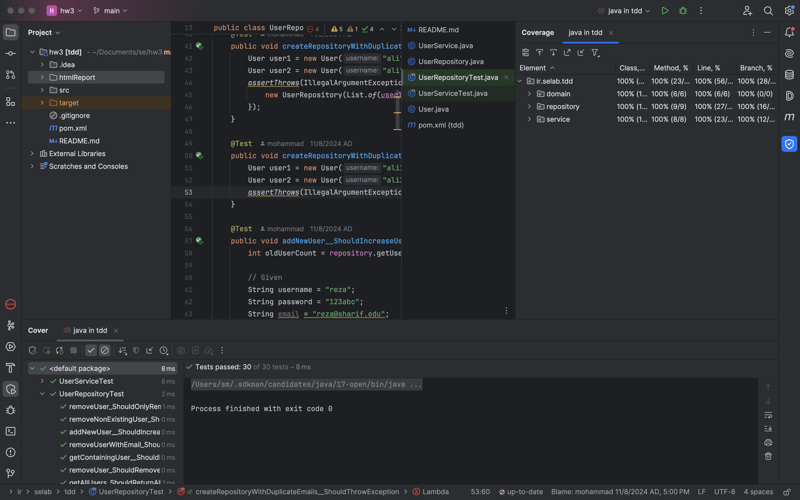

[Kanban Project](https://github.com/users/MohammadMoshtagh/projects/2/views/1)

# سیستم مدیریت کاربران

این پروژه یک نمونه برای آموزش ایجاد نرم افزار به روش مبتنی بر آزمون (TDD) می‌باشد.

## پیاده‌سازی
برای این پروژه ما دو فاز اصلی در نظر گرفتیم. یکی برای پیاده‌سازی قابلیت پشتبیانی از ایمیل در ثبت‌نام و ورود و دیگری برای حذف و گرفتن لیست کاربران است. بخش اول را من و هستی پیاده‌سازی کردیم و بخش دوم را مهراد.

برای بخش اول من و هستی به اینگونه وظایف را تقسیم کردیم که هستی در هر مرحله برای یک تابع پیاده‌سازی نشده Unit Test می‌نوشت و بعد از آن من به سراغ پیاده‌سازی می‌رفتم به صورتی که تست نوشته شده را پاس کنم. این موضوع را می‌توانید از ترتیب و تایتل کامیت‌های ما دنبال کنید. 

برای بخش دوم هردوی این کارها را مهراد انجام می‌داد و به این صورت با استفاده از روش TDD فیچرهای حذف کاربر و گرفتن لیست کاربران را پیاده‌سازی کرد. 

## Coverage
قبل از پیاده‌سازی:

بعد از پیاده‌سازی:

